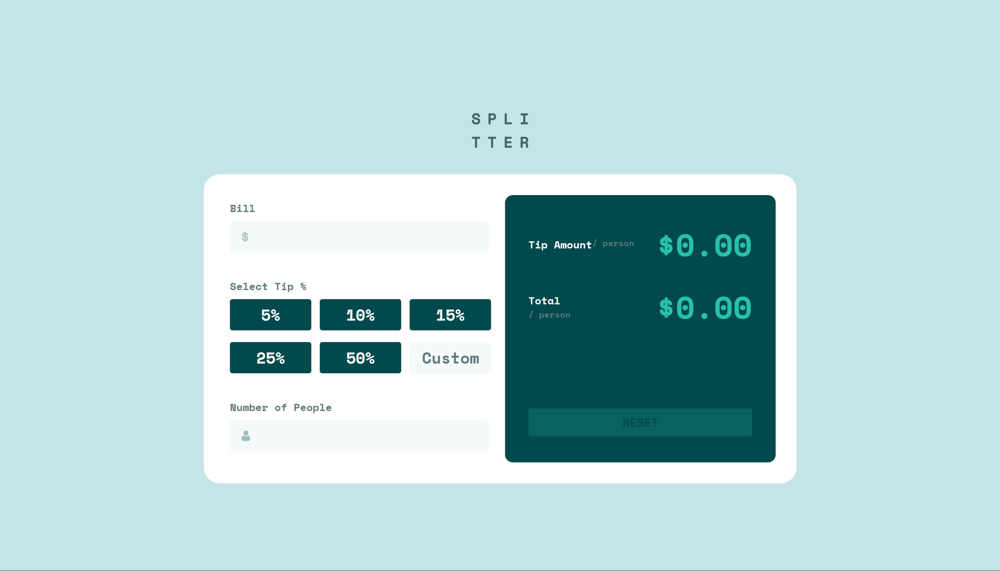

# Frontend Mentor - Tip calculator app solution

This is a solution to the [Tip calculator app challenge on Frontend Mentor](https://www.frontendmentor.io/challenges/tip-calculator-app-ugJNGbJUX). Frontend Mentor challenges help you improve your coding skills by building realistic projects.

## Table of contents

- [Overview](#overview)
  - [The challenge](#the-challenge)
  - [Screenshot](#screenshot)
  - [Links](#links)
- [My process](#my-process)
  - [Built with](#built-with)
  - [What I learned](#what-i-learned)
  - [Continued development](#continued-development)
  - [Useful resources](#useful-resources)
- [Author](#author)
- [Acknowledgments](#acknowledgments)

**Note: Delete this note and update the table of contents based on what sections you keep.**

## Overview

### The challenge

Users should be able to:

- View the optimal layout for the app depending on their device's screen size
- See hover states for all interactive elements on the page
- Calculate the correct tip and total cost of the bill per person

### Screenshot




### Links

- Solution URL: [GitHub](https://github.com/rawrisotto/tip-calculator-app-main)
- Live Site URL: [Netlify](https://your-live-site-url.com)

## My process

### Built with

- Semantic HTML5 markup
- CSS custom properties
- Flexbox
- CSS Grid
- Mobile-first workflow
- [React](https://reactjs.org/) - JS library
- [Next.js](https://nextjs.org/) - React framework
- [Styled Components](https://styled-components.com/) - For styles

**Note: These are just examples. Delete this note and replace the list above with your own choices**

### What I learned

- How to change placeholder color
```css
.tip-custom::placeholder {
  color: var(--clr-darkGrayishCyan);
}
```

- How to create input text with image in it (not 100% sure if correct)
```html
<div class="amount-input" id="number-people-amount-input">
  
  <input type="number" class="number-input" id="number-people-input" />
</div>
```
```css
.amount-input {
  display: flex;
  align-items: center;
  justify-content: space-between;
  background: var(--clr-veryLightGrayishCyan);
  border-radius: 0.25rem;
  border: 2px solid var(--clr-veryLightGrayishCyan);
  font-size: 1.5rem;
  padding-left: 1rem;
}

.amount-input .number-input {
  width: 80%;
}

.number-input {
  color: var(--clr-veryDarkCyan);
  border: none;
  background: var(--clr-veryLightGrayishCyan);
  padding: 0.25rem 1rem;
  text-align: right;
}
```

- How to create custom radio checkboxes
```html
<input type="radio" id="tip-5" name="tip" value="5" />
<label for="tip-5" class="tip-label">5%</label>
```
```css
.tip-label {
  padding: 0.375rem 0;
  background: var(--clr-veryDarkCyan);
  color: var(--clr-white);
  width: 150px;
  text-align: center;
  border-radius: 0.25rem;
  cursor: pointer;
}

.tip-wrapper input[type="radio"] {
  display: none;
}

.tip-wrapper input[type="radio"]:checked + .tip-label {
  background: var(--clr-strongCyan);
  color: var(--clr-veryDarkGrayishCyan);
}

.tip-wrapper input[type="radio"]:hover + .tip-label {
  background: var(--clr-lightGrayishCyan);
  color: var(--clr-veryDarkGrayishCyan);
}
```

- Remove spinner button for number type
```css
.number-input::-webkit-outer-spin-button,
.number-input::-webkit-inner-spin-button {
  -webkit-appearance: none;
  margin: 0;
}
```

### Continued development

Use this section to outline areas that you want to continue focusing on in future projects. These could be concepts you're still not completely comfortable with or techniques you found useful that you want to refine and perfect.

**Note: Delete this note and the content within this section and replace with your own plans for continued development.**

### Useful resources

- [Example resource 1](https://www.example.com) - This helped me for XYZ reason. I really liked this pattern and will use it going forward.
- [Example resource 2](https://www.example.com) - This is an amazing article which helped me finally understand XYZ. I'd recommend it to anyone still learning this concept.

**Note: Delete this note and replace the list above with resources that helped you during the challenge. These could come in handy for anyone viewing your solution or for yourself when you look back on this project in the future.**

## Author

- Website - [Add your name here](https://www.your-site.com)
- Frontend Mentor - [@yourusername](https://www.frontendmentor.io/profile/yourusername)
- Twitter - [@yourusername](https://www.twitter.com/yourusername)

**Note: Delete this note and add/remove/edit lines above based on what links you'd like to share.**

## Acknowledgments

This is where you can give a hat tip to anyone who helped you out on this project. Perhaps you worked in a team or got some inspiration from someone else's solution. This is the perfect place to give them some credit.

**Note: Delete this note and edit this section's content as necessary. If you completed this challenge by yourself, feel free to delete this section entirely.**
