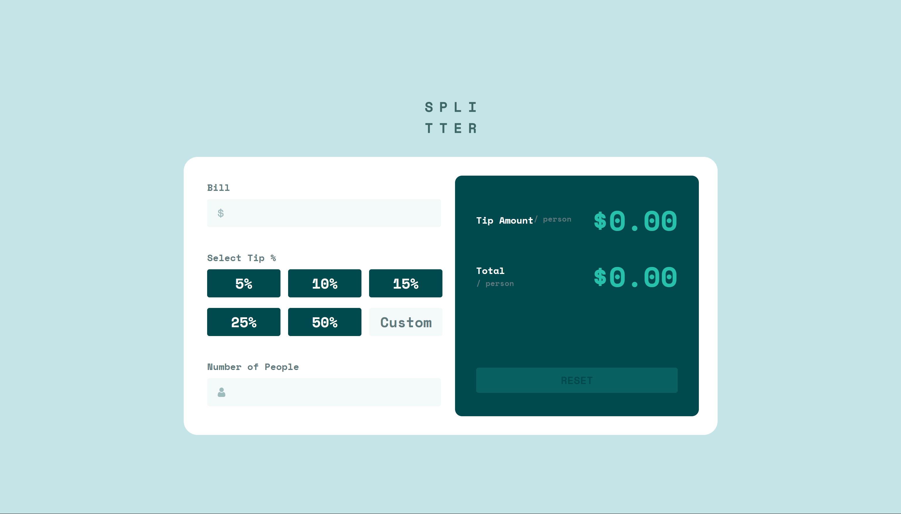
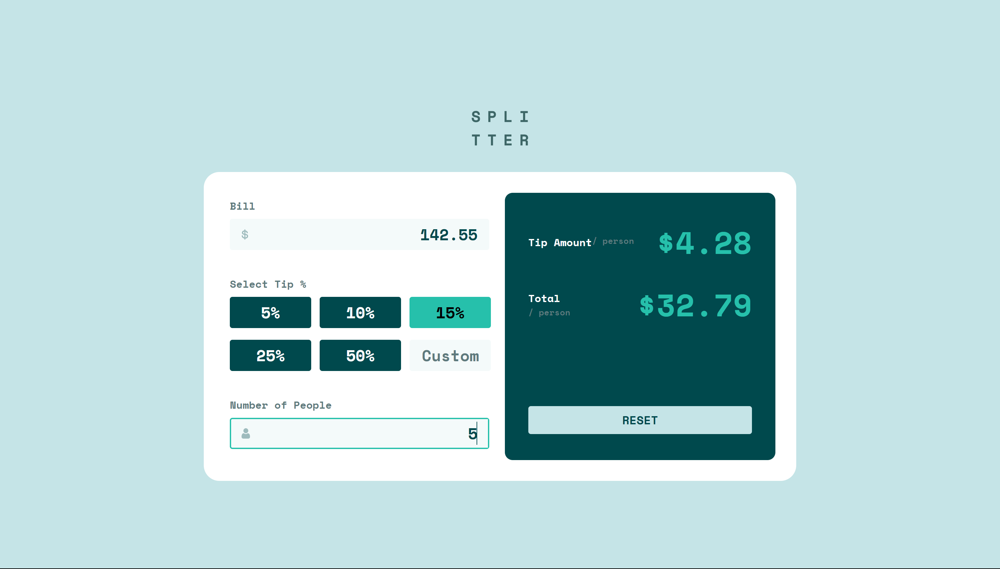

# Frontend Mentor - Tip calculator app solution

This is a solution to the [Tip calculator app challenge on Frontend Mentor](https://www.frontendmentor.io/challenges/tip-calculator-app-ugJNGbJUX). Frontend Mentor challenges help you improve your coding skills by building realistic projects.

## Table of contents

- [Overview](#overview)
  - [The challenge](#the-challenge)
  - [Screenshot](#screenshot)
  - [Links](#links)
- [My process](#my-process)
  - [Built with](#built-with)
  - [What I learned](#what-i-learned)
  - [Continued development](#continued-development)
- [Author](#author)

## Overview

### The challenge

Users should be able to:

- View the optimal layout for the app depending on their device's screen size
- See hover states for all interactive elements on the page
- Calculate the correct tip and total cost of the bill per person

### Screenshot




### Links

- Solution URL: [GitHub](https://github.com/rawrisotto/tip-calculator-app-main)
- Live Site URL: [Netlify](https://65ebd591f0eed84cf24a2d82--teal-gumdrop-f6088a.netlify.app/)

## My process

### Built with

- Semantic HTML5 markup
- CSS custom properties
- Flexbox
- Mobile-first workflow
- JavaScript

### What I learned

- How to change placeholder color
```css
.tip-custom::placeholder {
  color: var(--clr-darkGrayishCyan);
}
```

- How to create input text with image in it (not 100% sure if correct)
```html
<div class="amount-input" id="number-people-amount-input">
  
  <input type="number" class="number-input" id="number-people-input" />
</div>
```
```css
.amount-input {
  display: flex;
  align-items: center;
  justify-content: space-between;
  background: var(--clr-veryLightGrayishCyan);
  border-radius: 0.25rem;
  border: 2px solid var(--clr-veryLightGrayishCyan);
  font-size: 1.5rem;
  padding-left: 1rem;
}

.amount-input .number-input {
  width: 80%;
}

.number-input {
  color: var(--clr-veryDarkCyan);
  border: none;
  background: var(--clr-veryLightGrayishCyan);
  padding: 0.25rem 1rem;
  text-align: right;
}
```

- How to create custom radio checkboxes
```html
<input type="radio" id="tip-5" name="tip" value="5" />
<label for="tip-5" class="tip-label">5%</label>
```
```css
.tip-label {
  padding: 0.375rem 0;
  background: var(--clr-veryDarkCyan);
  color: var(--clr-white);
  width: 150px;
  text-align: center;
  border-radius: 0.25rem;
  cursor: pointer;
}

.tip-wrapper input[type="radio"] {
  display: none;
}

.tip-wrapper input[type="radio"]:checked + .tip-label {
  background: var(--clr-strongCyan);
  color: var(--clr-veryDarkGrayishCyan);
}

.tip-wrapper input[type="radio"]:hover + .tip-label {
  background: var(--clr-lightGrayishCyan);
  color: var(--clr-veryDarkGrayishCyan);
}
```

- Remove spinner button for number type
```css
.number-input::-webkit-outer-spin-button,
.number-input::-webkit-inner-spin-button {
  -webkit-appearance: none;
  margin: 0;
}
```

### Continued development

I am still learning JavaScript and the code that I have written is rather messy. Would focus more on JavaScript from now on after having a lot of practice with HTML and CSS. Need to find ways to make JavaScript code more efficient and optimized.

## Author

- GitHub - [rawrisotto](https://github.com/rawrisotto)
- Frontend Mentor - [@rawrisotto](https://www.frontendmentor.io/profile/rawrisotto)
